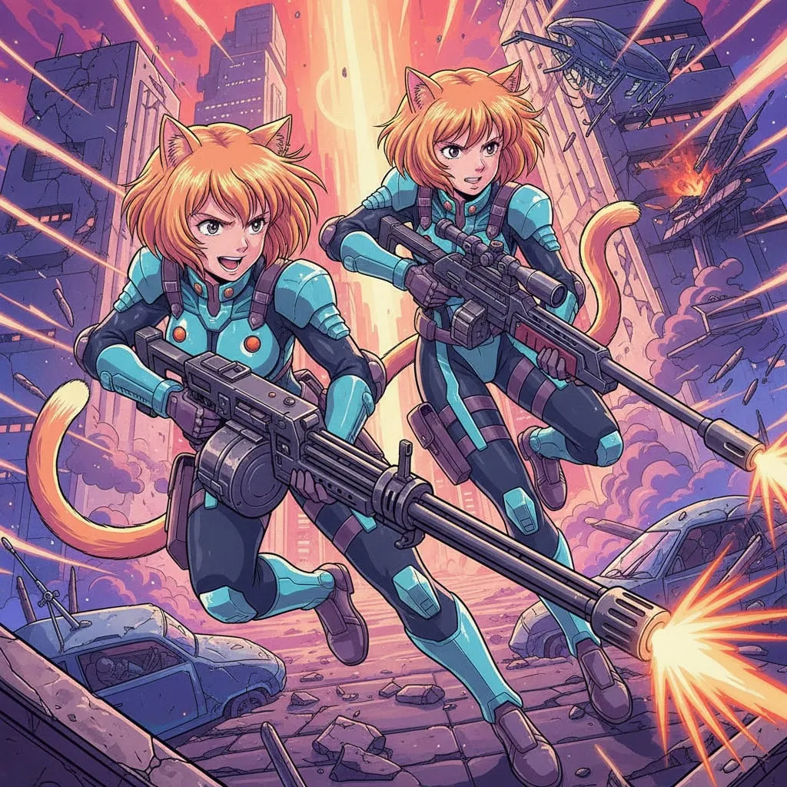
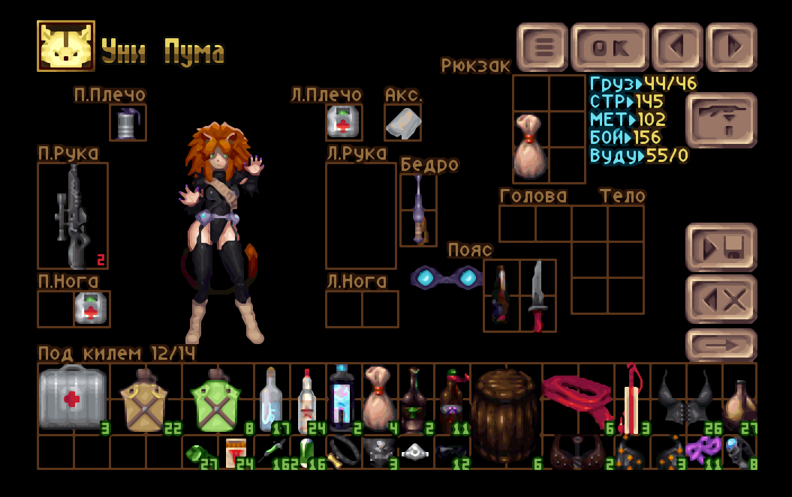

# We Are the Lore: Puma Sisters!

Мод для [X-Piratez](https://openxcom.org/forum/index.php?topic=3626.0), возвращающий в игру **Сестёр Пума** в качестве игровых персонажей.  
Основан на версии **N10** (последней, где сестры ещё присутствовали), с небольшими *вынужденными* изменениями.

---

## 📥 Установка
1. Скачайте [последний релиз](https://github.com/ChieftainGreen/We-are-the-lore/releases/tag/v0.5) мода.  
2. Распакуйте в папку `mods` вашей установки **X-Piratez**.  
3. В меню модов включите **We Are the Lore**, разместив его **после X-Piratez**.  
   *(начинать новую игру не требуется)*

---

## 🎮 Как получить Сестёр Пума

### Этап 1
- Получите **четвёртый ранг** капитана.  
- Изучите исследование *VIP: Сестры Пумы* (через «!Социализация!»). *(в оригинале нужно было изучить статьи про Анну и Пуму отдельно, но в современных версиях их нет в пиратопедии, и я пока не разбирался, как их добавить)*
- Потребуйте и выполните особое задание (*важно: не отменяйте его!*).  
- Дождитесь начала нового месяца — с вероятностью  
  - 70% для пути Кошей,  
  - 23% для остальных путей  
  появится событие `STR_PUMA_SISTERS_PREQ`.  
- Если событие появилось, то через ~30 дней (43400 минут) вы увидите сообщение «Сёстры вас заметили».

### Этап 2
- Получите **седьмой ранг**.  
- Дождитесь начала нового месяца.  
- События появления Сестёр гарантированы (100%):  
  - Через ~8.5 дней (12240 минут) Анна Пума пошлет сообщение.  
  - Еще через 1,5 часа (12330 минут всего) Уни Пума сделает то же самое.  
- После сообщений откройте меню «доставки» главной базы и дождитесь их прибытия.

---

## 📸 Скриншоты

---

## Совместимость
- Мод *в теории, должен быть технически совместим* с будущими версиями X-piratez, пока в них присутствуют ресурсы: STR_SOLDIER_NEKOMIMI_O (Outlaw Catgirl), STR_NEKO_UNIPUMA (Unipuma Uniform) и несколько других (например, музыка DTPDANCE). 

---

## FAQ
В: Событие не произошло, что делать?  
О: Проверьте требования этапа 1. Если все присутствует в сохранении, то попробуйте менять rng перед наступлением нового месяца (мне при тестировании потребовалось больше больше десятка изменений rng, так что я не уверен, как работают эти 23%). Также можно в файле events.rul исправить обе строки executionOdds: на 100, перезапустить игру и пройти в новый месяц.  
Этап 2 гораздо проще и с ним проблем не должно быть.

---

### TODO
- отдельная версия со 100% выпадением первого этапа, потому что кошкопираткам нужна вся добыча, а не проценты.
- скрипт для проверки quicksave

---

## 🙏 Благодарности
- Создателям **OXCE** и **X-Piratez**.  
- Создателям коше-пираток 🐾.  
- Сообществу [vk.com/xpiratez](https://vk.com/xpiratez).  
